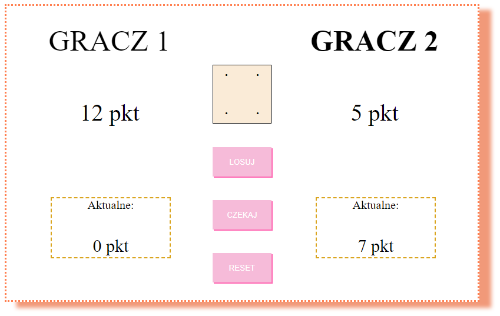
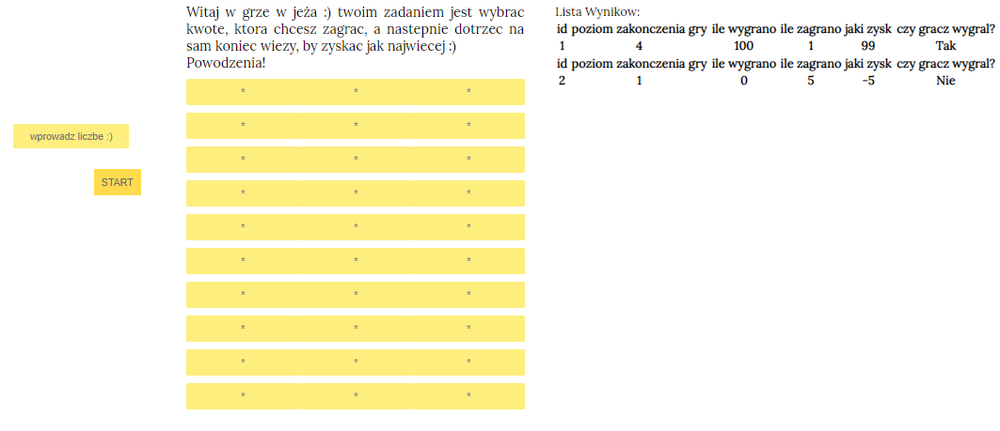
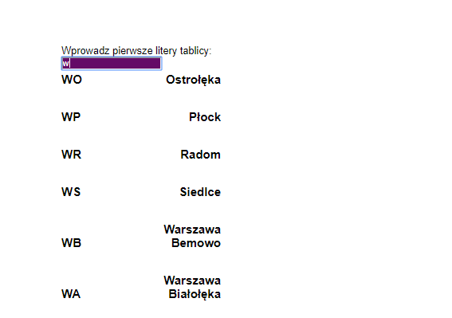
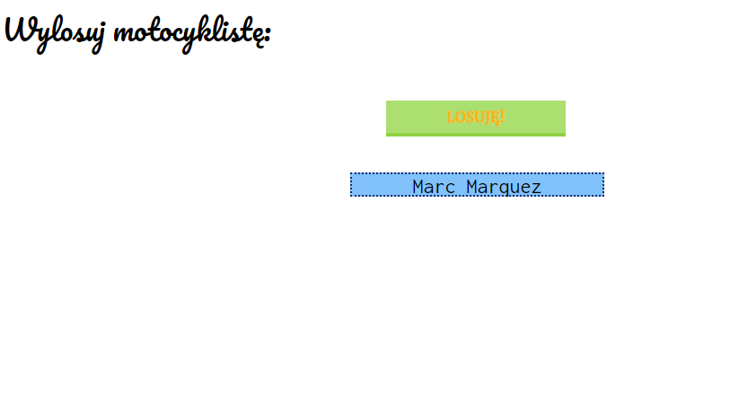

Hello, this repository contains my first ten weeks of working with programming. 

Main technologies used are:
- HTML & CSS
- plain Javascript
- Typescript.js
- React.js
- *one project is in Python

in summary there were 74 commits and 33 projects (with different level of difficulty)

***
TOP 5 PROJECTS
***
# 1. Pig Dice Roll Game

LINK:
https://scrumptiouscherry.github.io/pierwsze_trzy_tygodnie/gra-pig-dice-roll/index.html

In this game you and your friend can roll the dice and get points. But watch out for 6! It cleans your small points.

Here I used HTML, Typescript.js. In addition I wrote one end-to-end test in testcafe.

# 2. Tower Game

LINK:
https://scrumptiouscherry.github.io/pierwsze_trzy_tygodnie/npm_react/gra-wieza/build/index.html

Here you can test your luck and go to the last level of the tower.

I used HTML, CSS, React.js.

# 3. Tic Tac Toe - logic of the game

LINK: ./typescript/index.ts

In Typescript.js I wrote the whole logic of the game I've also added complete tests there. 

# 4. Polish License Plate App

LINK: https://scrumptiouscherry.github.io/pierwsze_trzy_tygodnie/npm_react/tablice/build/index.html

After typing the beggining of a license plate you can find what town it's from.

I used HTML, CSS and React.js.

# 5. Pick a Rider App

LINK: 
https://scrumptiouscherry.github.io/pierwsze_trzy_tygodnie/pick-a-rider/build/index.html

After you click the button you can get a random MotoGP rider.

I used HTML, CSS and React.js

***
***
***
Moreover here you can find my finished lectures with materials.

## *ES6 course  
LINK: ./npm_react/kurs-es6/ 

source: https://egghead.io/courses/learn-es6-ecmascript-2015

## *React Complete Guide
LINK: ./npm_react/react-complete-guide/

source: https://www.udemy.com/react-the-complete-guide-incl-redux/learn/v4/content

_PS. It's time to close the first ten weeks :)_
